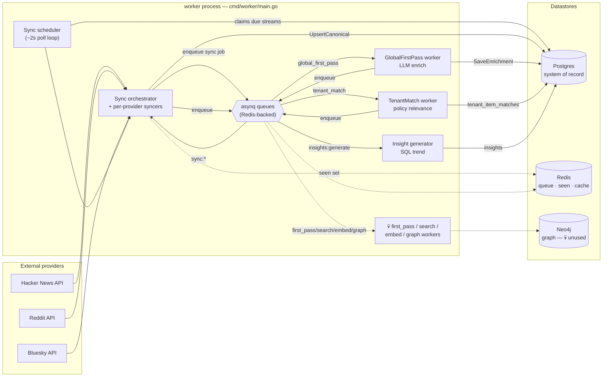
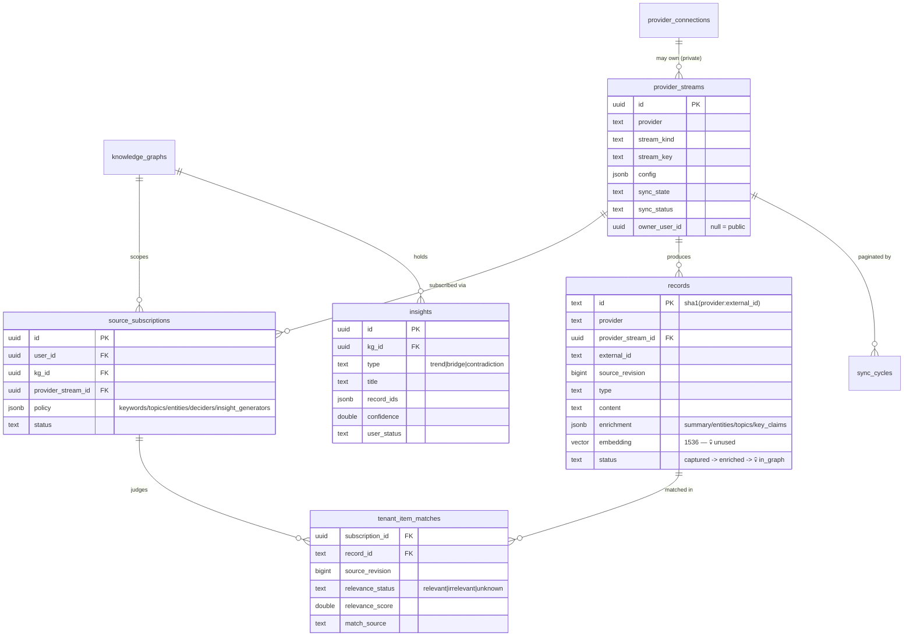
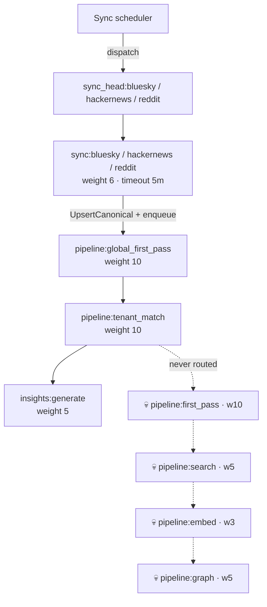
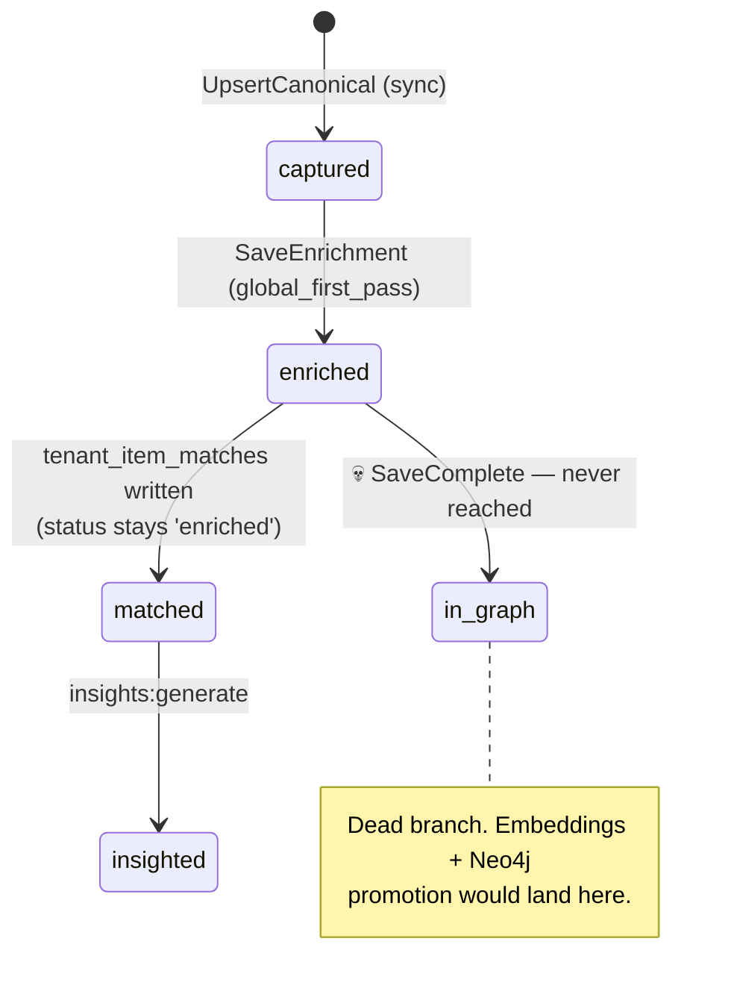

# Aladin Ingestion & Enrichment Pipeline

> **Authoritative architecture overview** for how external content flows into Aladin,
> gets enriched, matched to users, and turned into insights.
> Last verified against the code on **2026-06-10**.
>
> This supersedes the older `PIPELINE_PLAN.md` (a v2 design sketch). It links the two
> living references — [`GLOBAL_SOURCE_ITEM_PIPELINE.md`](./GLOBAL_SOURCE_ITEM_PIPELINE.md)
> (data model + correctness rules) and [`PIPELINE_AUDIT.md`](./PIPELINE_AUDIT.md)
> (dead-code audit + remediation plan) — and [`DEV_OPS_HARNESS.md`](./DEV_OPS_HARNESS.md)
> (ops commands) and [`NANGO_PROVIDER_CONNECTIONS.md`](./NANGO_PROVIDER_CONNECTIONS.md).

---

## 1. TL;DR

Aladin continuously polls a set of **public provider streams** (Hacker News, Reddit,
Bluesky), captures each item once into a canonical `records` table, enriches it **once**
with an LLM, matches it against each user's **subscriptions**, and emits **insights** into
the relevant knowledge graphs. It runs as a single `worker` process built on
**asynq + Redis** for queuing and **Postgres** as the system of record.

**The live flow is:**

```
provider stream  →  sync queue  →  records (status=captured)
   →  pipeline:global_first_pass  →  LLM enrich  →  records (status=enriched)
   →  pipeline:tenant_match       →  policy match →  tenant_item_matches
   →  insights:generate           →  SQL trend    →  insights
```

> ⚠️ **Important — partially-dead scaffold.** Four workers (`first_pass`, `search`,
> `embed`, `graph`) and their queues are **wired but never triggered** in the live flow —
> no task is ever routed to them. That means **embeddings and the Neo4j graph are not
> currently populated by ingestion.** See [§8](#8-the-dead-branch-firstpass--search--embed--graph)
> and `PIPELINE_AUDIT.md`. The doc marks dead paths with a 💀 and dashed arrows.

---

## 2. System context



**Three processes, three stores.** The pipeline lives entirely in the **`worker`**
process. The **`api`** process (`:8080` by default, run on `:8000` in dev) serves the
React/Tauri client and the source/record/provider HTTP routes; the **`mcp`** process
(`:8090`) serves agent tools. All three share Postgres; only the worker touches the asynq
queues and external provider APIs.

| Store | Role |
|---|---|
| **Postgres** | System of record: `records`, `provider_streams`, `source_subscriptions`, `sync_cycles`, `tenant_item_matches`, `insights`, `provider_connections`. Schema via embedded **goose** migrations applied on boot. |
| **Redis** | Backs the **asynq** queues; also holds the per-stream **seen set** (traversal boundary) and the **Tavily search cache** (7-day TTL, dead path). |
| **Neo4j** | Entity/topic graph. **Optional** (`NEO4J_URI`) and currently **unpopulated** — the only writer is the dead `graph` worker. |

---

## 3. Data model

A **source** is a *subscription* (`source_subscriptions`) that binds a user + knowledge
graph to a reusable **provider stream** (`provider_streams`). Many users can subscribe to
the same public stream with different relevance policies. A **record** is one captured
item (post/article/comment) from a stream. Relevance is *not* stored on the record — it
lives per-subscription in `tenant_item_matches`, so one record can be relevant to many KGs
with different scores.



Definitions and correctness rules are specified in
[`GLOBAL_SOURCE_ITEM_PIPELINE.md`](./GLOBAL_SOURCE_ITEM_PIPELINE.md).

> **Note on providers.** `SourceService` understands `hackernews_feed`,
> `reddit_subreddit`, `bluesky_search`, and `twitter_search` source kinds
> (`internal/service/sources.go`), but only **three syncers** are wired in the worker —
> Bluesky, Hacker News, Reddit (`cmd/worker/main.go:148-150`). Twitter has no live syncer.
>
> **Note on provider connections.** OAuth connections via **Nango** (Google, Slack, …) are
> a *separate* subsystem (`internal/service/provider_connections*.go`). They authenticate
> users and *can* back private `provider_streams`, but **do not currently feed records into
> this pipeline** — they are orthogonal to the public-stream ingestion described here.

---

## 4. The live pipeline, stage by stage

```mermaid
sequenceDiagram
  autonumber
  participant SCH as Scheduler
  participant ORCH as Orchestrator/Syncer
  participant PG as Postgres
  participant Q as asynq (Redis)
  participant GFP as GlobalFirstPass
  participant AI as OpenAI (gpt-4o-mini)
  participant TM as TenantMatch
  participant INS as Insight generator

  SCH->>PG: ClaimBatch() — lock a due provider_stream
  SCH->>ORCH: dispatch sync job (cursor from sync_cycles)
  ORCH->>Q: EnqueueSync → sync_head:{provider}
  Q->>ORCH: deliver sync:{provider} task
  ORCH->>ORCH: syncer.Execute() — fetch provider API
  ORCH->>PG: UpsertCanonical(record) — status=captured
  Note over ORCH,PG: dedup id=sha1(provider:external_id);<br/>update only if source_revision is strictly newer
  ORCH->>Q: EnqueueGlobalFirstPass(recordID)  [only if Changed]
  ORCH->>PG: advance sync_cycle (HasMore? page : complete)

  Q->>GFP: deliver pipeline:global_first_pass
  GFP->>AI: Enrich(content) — summary/entities/topics/claims
  AI-->>GFP: EnrichResult
  GFP->>PG: SaveEnrichment — status=enriched (WHERE source_revision matches)
  GFP->>Q: EnqueueStage(tenant_match, recordID)

  Q->>TM: deliver pipeline:tenant_match
  TM->>PG: load record + stream + active subscriptions
  TM->>TM: PolicyRelevanceDecider — keyword/substring match
  TM->>PG: Save tenant_item_matches (per subscription)
  TM->>Q: EnqueueInsightGeneration(kgID, recordID)  [per relevant KG]

  Q->>INS: deliver insights:generate
  INS->>PG: GenerateForRecord — SQL topic-trend over enriched records
  INS->>PG: insert insights (type=trend)
```

### 4.1 Ingestion — sources & provider streams
A user subscribes via `POST /api/sources` (`internal/api/sources.go`). `SourceService`
(`internal/service/sources.go`) upserts a shared `provider_streams` row (deduped by
`provider/stream_kind/stream_key`) and a `source_subscriptions` row bound to the user's
knowledge graph. Subscribing creates **metadata only** — no records yet.

### 4.2 Scheduling & sync
The **scheduler** (`internal/sync/scheduler.go`) is a generic poll loop (~2s idle backoff)
that calls `Orchestrator.ClaimBatch()` to atomically lock **due** provider streams
(`sync_state=active`, `sync_status=idle`). For each, a **`FreshnessFirstArbiter`**
(`internal/sync/orchestrator.go`) decides refresh vs hydration vs skip, the per-provider
**syncer** builds a `SyncJob` whose payload is the **cursor** from an open `sync_cycles`
row, and the orchestrator **dispatches** it to the syncer's head queue
(`sync_head:{provider}`). A worker then pulls the task and runs `syncer.Execute()`, which
fetches the provider API and returns a `Result{Records, HasMore, CompletionReason, …}`.
A Redis **seen set** (`RedisSeenStore`) records external IDs to detect the traversal
boundary and stop infinite pagination (`CompletionReasonSeenOverlap`).

### 4.3 Record capture (canonical)
`RecordResultHandler.HandleSuccess()` (`internal/sync/result_handler.go`) loops the
syncer's records and calls `recordRepo.UpsertCanonical()` (`internal/db/record_repo.go`):

- **ID** = `sha1(provider:external_id)` (deterministic, so re-fetches dedupe).
- **`ON CONFLICT (id) DO UPDATE`** only when the incoming `source_revision` is **strictly
  newer** — stale re-ingestion is dropped. The result's `Changed` flag is set only on a
  new or newer row.
- New row → `status='captured'`, `enrichment=NULL`.

**Capture boundary invariant:** for each `Changed` record the handler enqueues a
`pipeline:global_first_pass` task **before** the stream's progress (`last_refresh_at`,
cursor) is advanced. A crash before the enqueue replays the page; the stream is never
marked "done" while a record is un-enqueued. (Caveat: upsert + enqueue are not one
transaction — see [§9](#9-correctness-invariants).)

### 4.4 Global first-pass enrichment (LLM)
`GlobalFirstPassWorker` (`internal/pipeline/workers/global_first_pass.go`) calls
`enricher.Enrich(content, type)` against **OpenAI `gpt-4o-mini`** (shared **60 RPM** rate
limiter) and gets back `{Summary, Entities, Topics, KeyClaims, LowConfidenceEntities}`.
`FullPipelineHandler.OnDone` then persists via `recordRepo.SaveEnrichment()`:
`UPDATE records SET enrichment=…, status='enriched' WHERE id=… AND source_revision=…`
(the **revision guard** — out-of-order enrichment of a stale revision is silently
dropped). It then enqueues `pipeline:tenant_match`.

### 4.5 Tenant matching (policy, not LLM)
`TenantMatchWorker` (`internal/pipeline/workers/tenant_match.go`) loads the record, its
stream, and all **active subscriptions** to that stream. For each subscription it runs the
`PolicyRelevanceDecider` (`internal/pipeline/workers/relevance.go`):

- Merge the stream's and subscription's policy `keywords + topics + entities + domains`.
- Build a lowercased haystack from the record's title/url/domain/content/context/summary/
  entities/topics/claims and do **substring matching**.
- No terms configured → `relevant` (score 0.5); a term matches → `relevant` (score 0.65);
  otherwise `no_decision`.

Matches are written to `tenant_item_matches` (unique on
`subscription_id, record_id, source_revision`). For each relevant KG an `InsightTrigger`
is collected.

> An **`OpenAIRelevanceJudge` exists** (`internal/llm/openai.go`) but is **not wired** —
> relevance is keyword-only today. LLM-based relevance is a planned upgrade.

### 4.6 Insight generation (terminus)
On `ResultTenantMatchDone`, `FullPipelineHandler.enqueueInsightTriggers`
(`internal/pipeline/handler.go:94-117`) enqueues a per-record **`insights:generate`** task
per relevant KG. `GenerateHandler` → `Generator.GenerateForRecord`
(`internal/insights/generator.go`) runs **pure-SQL trend detection** (`topic_trend`
generator: aggregate topics across recently-enriched records in the KG) and inserts
`type='trend'` rows into `insights` (3-day dedup window). **No LLM is used for insights.**

> Two insight paths exist. The **live** one is the `insights:generate` queue above
> (per-record `GenerateForRecord`). A second in-process `insights.Worker`
> (`internal/insights/worker.go`) drains a buffered channel of KG ids and runs the per-KG
> `GenerateAndStore`, but that channel is fed only from the **dead** final-persist branch
> (`handler.go:228`), so it is effectively inactive today.

---

## 5. asynq queue topology

One asynq `Server` (`cmd/worker/main.go:166`) runs all queues with weighted priority,
`Concurrency = WORKER_CONCURRENCY` (default **16**), `MaxRetry=3`, a rate-limit-aware
`RetryDelayFunc` (`pipeline.RetryDelay`), and an `IsFailure` that does **not** burn retry
budget on `ErrRateLimit`. There is **no `asynq.Scheduler`** — recurring work is the custom
DB-polling sync scheduler. There is **no explicit dead-letter queue**; exhausted tasks sit
in asynq's retry/archive sets.



| Queue / task type (verbatim) | Worker | Weight | Live? | Notes |
|---|---|---|---|---|
| `sync_head:{provider}` + `sync:{provider}` | per-provider syncer | 6 | ✅ | Head = dispatched job; same handler serves both. `MaxRetry=3`, timeout **5m**. |
| `pipeline:global_first_pass` | `GlobalFirstPassWorker` | 10 | ✅ | LLM enrich → `status=enriched`. |
| `pipeline:tenant_match` | `TenantMatchWorker` | 10 | ✅ | Policy match → `tenant_item_matches`. |
| `insights:generate` | `insights.GenerateHandler` | 5 | ✅ | SQL trend → `insights`. |
| `pipeline:first_pass` | `FirstPassWorker` | 10 | 💀 | Never enqueued. |
| `pipeline:search` | `SearchWorker` (Tavily, 20 RPM) | 5 | 💀 | Never enqueued. |
| `pipeline:embed` | `EmbedWorker` (text-embedding-3-small) | 3 | 💀 | Never enqueued. |
| `pipeline:graph` | `GraphWorker` (Neo4j) | 5 | 💀 | Never enqueued; no-op if `NEO4J_URI` unset. |

**Idempotency:** every pipeline/insight task uses a deterministic `TaskID`
(`recordID:taskType`, or `insights:generate:kgID:rev:recordID`); `asynq.ErrTaskIDConflict`
is swallowed, so re-enqueues are safe and a record sits in at most one stage at a time.

---

## 6. LLM enrichment details

| Aspect | Value | Source |
|---|---|---|
| Enrichment model | **`gpt-4o-mini`** (hardcoded) | `internal/llm/openai.go` |
| Embedding model | **`text-embedding-3-small`**, 1536-dim (💀 dead path) | `internal/llm/openai.go` |
| Rate limit | **60 RPM** shared across all OpenAI calls | `cmd/worker/main.go:92` |
| Web search | **Tavily**, 20 RPM, 7-day Redis cache (💀 dead path) | `internal/search` |
| Enrichment output | `summary`, `entities[]`, `topics[]`, `key_claims[]`, `low_confidence_entities[]` | stored in `records.enrichment` JSONB |
| Relevance LLM | **none** — keyword matching only (`OpenAIRelevanceJudge` defined but unwired) | `relevance.go`, `openai.go` |
| Insight LLM | **none** — SQL topic-trend aggregation | `internal/insights/generator.go` |

**Known limits (today):** model ids are not env-configurable (code patch to change);
no token/cost accounting; no batching (1000 records → 1000 sequential calls under the
60 RPM cap); retries are at the asynq layer (`MaxRetry=3`, exponential backoff), not inside
the LLM client.

---

## 7. Record status lifecycle



`records.status` itself only moves `captured → enriched` in the live flow. Tenant
relevance and insights are tracked in **separate tables** (`tenant_item_matches`,
`insights`), not on the record. `in_graph` is only reachable via the dead final-persist
path. (`enrichment.status='ready'` is an inner field of the enrichment JSON, distinct from
the record's `status`.)

---

## 8. The dead branch: FirstPass → Search → Embed → Graph

All six workers are registered (`cmd/worker/main.go:131-136`), but
`FullPipelineHandler.OnDone` only handles two result types —
`ResultGlobalFirstPassDone` and `ResultTenantMatchDone` (`internal/pipeline/handler.go:60-91`).
The `RecordPayload` that would drive `first_pass → search → embed → graph` is **never
enqueued**, so:

- **No embeddings** are generated (`records.embedding` stays NULL).
- **No Neo4j graph** is populated (the only writer is the dead `graph` worker; `NEO4J_URI`
  is also optional and unset in most envs).
- `records.status` never reaches `in_graph`.

This is intentional scaffolding from an earlier design. `PIPELINE_AUDIT.md` lays out the
remediation: **Phase A** prune the dead scaffold, **Phase B** add a terminal-failure record
status (so "stuck records" are queryable), **Phase C** design graph/embedding back into the
live flow deliberately rather than reviving the inherited path.

---

## 9. Correctness invariants

- **Capture boundary** — a record is "captured" only once it is both durably upserted
  *and* its `global_first_pass` task is accepted. Stream progress must not advance before
  this. ⚠️ Upsert and enqueue are **not one transaction**: if the enqueue fails after the
  upsert, the record is captured but orphaned from enrichment (re-trigger manually). There
  is no enqueue retry of its own.
- **Revision guard** — `UpsertCanonical` and `SaveEnrichment` are conditioned on
  `source_revision`; a stale revision can never overwrite newer data or enrichment.
- **Idempotency** — deterministic `TaskID`s + swallowed `ErrTaskIDConflict` make re-enqueues
  no-ops.
- **Seen boundary** — per-stream Redis seen set stops a refresh cycle at the last-seen item
  so pagination terminates.
- **Stuck-stream risk** — if a syncer crashes mid-execution, the stream can be left in
  `sync_status='syncing'` (no automatic timeout). Clean up with
  `make ops-reset-stuck-cycles AGE=30m`.

> The `outbox_events` table is **not** part of this pipeline — it belongs to the
> server-authoritative **client-state sync** system (desktop tree/artifact delivery).
> Don't confuse the two "syncs": provider **data** sync (this doc) vs **client-state** sync.

---

## 10. Running & operating it locally

**Dev stack** (your real data; `docker-compose.yml`): Postgres `:5433`, Redis `:6379`,
Neo4j `:7474/:7687`.

```bash
make db-up            # Postgres + Redis + Neo4j + Loki
make api-go           # Go API (:8000)
make worker-go        # the pipeline worker (optional CONCURRENCY=24)
# add a source, e.g. POST /api/sources, then watch it flow:
make ops-streams      # provider stream status
make ops-queues       # asynq/Redis queue depths
make ops-status       # combined dashboard
make ops-errors WINDOW=1h
make ops-force-stream PROVIDER=hackernews STREAM_KEY="..."   # force one stream due now
make ops-reset-stuck-cycles AGE=30m                          # unstick crashed syncs
```

**Sandbox stack** (isolated; never touches dev data — used by all automated tests):
Postgres `:5444`, Redis `:6380`, Neo4j `:7475/:7688`.

```bash
make test-db-up       # bring up the sandbox
make test-go          # Go tests against the sandbox DB
```

**Required env** for the worker: `DATABASE_URL`, `REDIS_URL`, `OPENAI_API_KEY`,
`TAVILY_API_KEY`. **Optional:** `NEO4J_URI`/`NEO4J_USER`/`NEO4J_PASS` (graph; disabled if
unset), `WORKER_CONCURRENCY` (default 16), `LOG_LEVEL`. Worker logs JSON to
`logs/worker.log` (shipped to Loki via Promtail). Provider-connection (Nango) env is in
[`NANGO_PROVIDER_CONNECTIONS.md`](./NANGO_PROVIDER_CONNECTIONS.md).

---

## 11. Key files

| Concern | File |
|---|---|
| Worker wiring / queue config | `cmd/worker/main.go` |
| Sync scheduler / orchestrator / arbiter | `internal/sync/scheduler.go`, `internal/sync/orchestrator.go` |
| Record capture + result handling | `internal/sync/result_handler.go`, `internal/db/record_repo.go` |
| Per-provider syncers | `internal/sync/syncers/` |
| Pipeline routing | `internal/pipeline/handler.go`, `internal/pipeline/orchestrator.go`, `internal/pipeline/enqueuer.go` |
| Workers | `internal/pipeline/workers/` (`global_first_pass.go`, `tenant_match.go`, `relevance.go`, + 💀 `first_pass/search/embed/graph.go`) |
| LLM clients | `internal/llm/openai.go` |
| Insights | `internal/insights/` (`generator.go`, `task.go`, `worker.go`) |
| Sources / records / provider connections API | `internal/api/{sources,records,provider_connections}.go`, `internal/service/` |
| Schema | `internal/db/migrations/*.sql` (embedded goose) |

---

## 12. Known gaps & follow-ups

1. **Dead Search/Embed/Graph branch** — no embeddings or graph today (`PIPELINE_AUDIT.md`).
2. **Provider connections (Nango) are not wired to ingestion** — OAuth works, but no
   records are produced from connected accounts yet.
3. **Relevance is keyword-only** — `OpenAIRelevanceJudge` exists but is unwired; KG-overlap
   / LLM relevance is planned.
4. **No terminal-failure record status** — exhausted tasks leave records silently in
   `captured`/`enriched`; "stuck records" aren't easily queryable (audit Phase B).
5. **Capture upsert + enqueue aren't atomic** — a failed enqueue orphans a captured record.
6. **Single worker process** — orchestrator + all workers share one process; scaling out
   would need the dispatch hand-off to move onto Redis/asynq fully.
