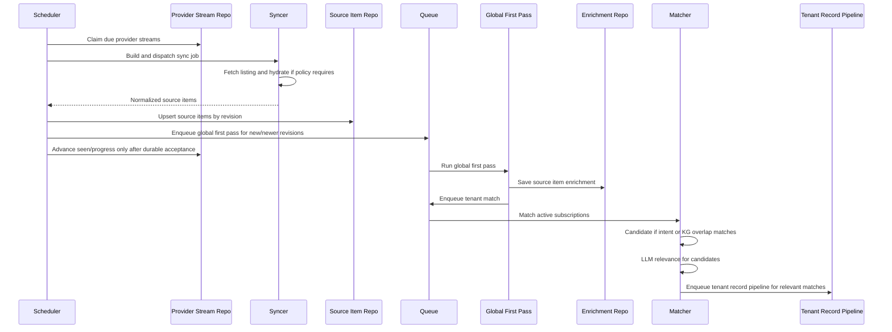

# Global Source Item Pipeline

## Status

Backend foundation implemented and now stream-native.

This document describes the current target architecture for public source ingestion, global enrichment, and tenant-specific matching. It is intentionally implementation-facing: it explains the backend data boundaries, worker flow, and correctness rules that should guide future source, enrichment, and realtime work.

## Goal

Aladin should fetch public provider content once, enrich it once, then personalize it per tenant or user subscription.

The previous shape treated a configured user `source` as the unit of fetching and pipeline work. That worked for a single-user prototype, but it duplicated provider work as soon as multiple users subscribed to the same stream. The current shape removes legacy `sources`/`snapshots` from the production model and separates:

- Provider transport: globally reusable public streams such as Hacker News top stories or Bluesky search.
- Source items: normalized durable provider items keyed by provider identity.
- Global enrichment: reusable summaries, entities, topics, and claims for each item revision.
- Tenant matching: user-specific relevance decisions against subscriptions and future KG overlap.
- Tenant records: derived user/KG output created only after a match is relevant.

## Core Model

### `provider_streams`

A fetchable public provider stream.

Examples:

- `hackernews/feed/topstories`
- `bluesky/search/ai agents`
- `reddit/subreddit/LocalLLaMA/hot`

Provider streams own transport policy:

- provider
- stream kind
- stream key
- fetch config
- sync status
- refresh timestamps
- scheduler state

Exact normalized `(provider, stream_kind, stream_key)` is unique. Semantic deduplication is deliberately deferred, so `ai agent` and `ai agents` are different streams for now.

### `source_subscriptions`

A tenant or user subscription to a provider stream.

Subscriptions own product intent:

- user id
- KG id
- provider stream id
- name
- visibility
- policy
- status

The policy is intentionally flexible JSON for future intent fields:

- keywords
- topics
- domains
- entities
- notification preferences
- mute/exclude rules

### `source_items`

The first durable ingestion boundary for normalized provider content.

Source items are unique by:

- public items: `(provider, external_id)`
- private items: `(provider, external_id, owner_user_id)`

Stored content is deliberately limited:

- title
- canonical/source URL
- content excerpt
- selected context/comment excerpts
- source revision
- provider metadata
- hydration metadata

Full raw provider JSON and full raw comment trees should not become product storage by default.

### `source_item_enrichments`

Global enrichment output keyed by `(source_item_id, source_revision)`.

This is reusable across tenants because it describes the provider item itself, not a user's relationship to it.

Current fields:

- summary
- entities
- topics
- key claims
- low-confidence entities
- optional embedding
- status

### `tenant_item_matches`

A tenant-specific decision for one source item revision and one subscription.

Current fields:

- subscription id
- source item id
- source revision
- match source
- overlap entities
- relevance status
- confidence/reason
- downstream record id

`records` remains tenant-specific derived output. It is not the provider cache.

Important boundary: `records` no longer carries `source_id`. Tenant/subscription context lives in `tenant_item_matches`, which links a subscription, source item revision, and optional downstream record id. This keeps tenant matching metadata out of the derived record row and avoids reusing the old `source_id` column for a new meaning.

## Runtime Flow

## Worker Responsibilities

### Sync Orchestrator

The sync orchestrator owns scheduler-to-provider execution.

It now supports provider streams as the production scheduling unit:

- claims due provider streams
- asks the source-specific syncer to build a job
- executes sync jobs
- upserts normalized source items
- enqueues global first pass for accepted new/newer revisions
- advances stream/cycle progress only after durable acceptance and enqueue success

Production sync wiring uses provider streams plus source items. The old `sources`, `snapshots`, and `sync_jobs` tables are removed by migration `00018_drop_legacy_sources.sql`.

### Source-Specific Syncers

Syncers should return normalized source item records, not tenant pipeline records.

Source-specific responsibilities:

- fetch provider data
- handle pagination cursors
- apply provider-specific hydration policy
- normalize provider ids and URLs
- include selected enrichment context
- include provider provenance metadata
- avoid returning raw provider blobs as product storage

Hydration can be source-specific. Hacker News, Bluesky, X, and future Reddit support do not need identical hydration policies.

### Global First Pass

Global first pass runs once per source item revision.

It extracts reusable information:

- summary
- entities
- topics
- key claims
- low-confidence entities

The output is stored in `source_item_enrichments`.

### Tenant Matcher

Tenant matching runs after global enrichment.

Candidate creation rule:

- subscription intent matches, or
- tenant KG entity overlap exists

Then LLM relevance decides whether a candidate should become tenant output.

Current implementation status:

- intent-policy matching is implemented
- LLM relevance judging is wired
- KG overlap is a planned collaborator and should be added without changing the source item model

### Tenant Record Pipeline

Relevant tenant matches enqueue the existing record pipeline with:

- KG id
- source item id in metadata
- subscription id in metadata
- source revision
- global enrichment copied into the tenant payload

The existing `records` table remains the tenant-specific derived output boundary, but it does not own provider stream or subscription identity. Queries that need source/subscription context should join through `tenant_item_matches` and then `source_subscriptions`.

## Correctness Rules

### Capture Boundary

A provider item is considered captured only after:

1. The normalized source item is durably upserted.
2. Required follow-up work is accepted into the queue.

Seen state, stream progress, and sync cycle progress must not advance before that boundary.

### Revision Guard

Source items are revisioned.

Newer revisions may update a source item. Stale revisions should not overwrite newer source item data, enrichment, or tenant output.

### Public Versus Private Items

Public items are globally reusable.

Private items use the same model but include `owner_user_id`. A private item must never match another user's subscription.

### Raw Retention

Provider raw data should be transient pipeline input unless there is a specific product reason to persist it.

Default durable storage should favor:

- normalized excerpts
- URLs
- counts
- selected comment excerpts
- provider metadata
- derived LLM/KG output

This matters for social providers where long-term raw retention may be restricted or undesirable.

## Product API Shape

The product-facing "sources" API can remain as naming if useful, but it maps to subscriptions, not legacy source rows.

Creating a public feed subscription should:

1. Normalize the provider stream input.
2. Ensure a `provider_streams` row exists.
3. Create or return the user's `source_subscriptions` row.

Users should not own refresh/hydration intervals for global public streams. Those are system transport policy. Users own relevance intent and notification policy.

## Current Implementation Files

Primary backend files:

- `backend_v2/internal/db/migrations/00017_global_source_items.sql`
- `backend_v2/internal/db/provider_stream_repo.go`
- `backend_v2/internal/db/source_item_repo.go`
- `backend_v2/internal/sync/orchestrator.go`
- `backend_v2/internal/pipeline/workers/global_first_pass.go`
- `backend_v2/internal/pipeline/workers/tenant_match.go`
- `backend_v2/internal/pipeline/handler.go`
- `backend_v2/internal/repo/sources_postgres.go`
- `backend_v2/internal/repo/feed_postgres.go`

Related existing systems:

- `backend_v2/internal/sync/syncers/*`
- `backend_v2/internal/pipeline/workers/first_pass.go`
- `backend_v2/internal/pipeline/workers/embed.go`
- `backend_v2/internal/pipeline/workers/graph.go`
- `backend_v2/internal/db/record_repo.go`

## Near-Term Gaps

### KG Overlap Matcher

Add a graph-backed matcher collaborator that can answer:

- which enriched source item entities overlap a tenant KG
- which artifacts/records explain that overlap
- whether overlap is strong enough to create a relevance candidate

No KG overlap should mean no LLM relevance call unless subscription intent matched.

### Legacy Source Cleanup

Legacy `sources`, `snapshots`, and `sync_jobs` are intentionally removed. No old source rows are migrated into provider streams or subscriptions. New subscriptions should be created through the provider-stream-aware source API.

`records.source_id` is also removed. Existing feed and insight queries that need source context should resolve it through:

1. `records.id`
2. `tenant_item_matches.record_id`
3. `tenant_item_matches.subscription_id`
4. `source_subscriptions.provider_stream_id`
5. `provider_streams`

### Matching Tests

Add deterministic tests for:

- no intent and no KG overlap skips LLM relevance
- intent match triggers relevance judging
- KG overlap triggers relevance judging
- private items never match another user
- duplicate events do not duplicate matches

### End-To-End Replay

Add a deterministic replay test:

1. Fetch one provider stream item.
2. Upsert one source item.
3. Write one global enrichment.
4. Match two tenant subscriptions differently.
5. Enqueue tenant output only for relevant matches.

## Design Direction

This is not a local Firebase clone and not a generic event framework. The architecture is deliberately domain-shaped:

- provider streams fetch data
- source items normalize data
- global enrichment extracts reusable facts
- tenant matching personalizes facts
- tenant records power the user-facing feed and graph

The narrow waist is the durable source item plus revision. That gives the system enough formal correctness for retries, hydration, replay, and later realtime/offline work without over-generalizing too early.
